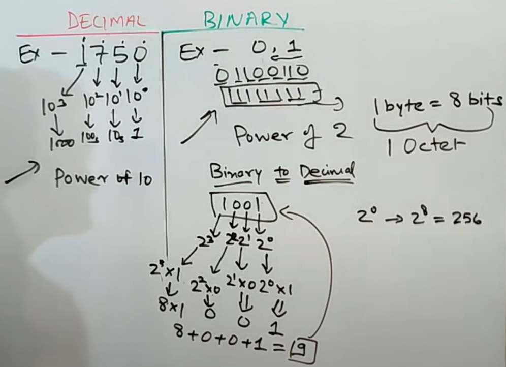
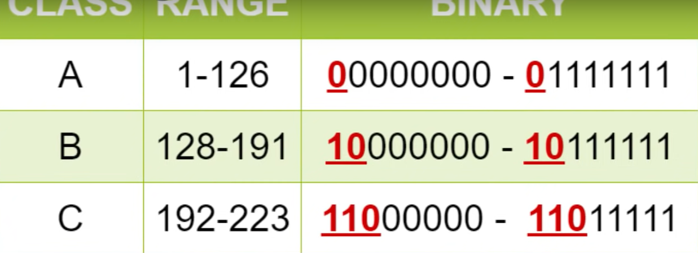
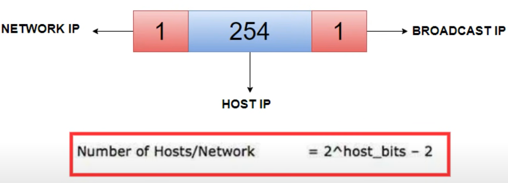
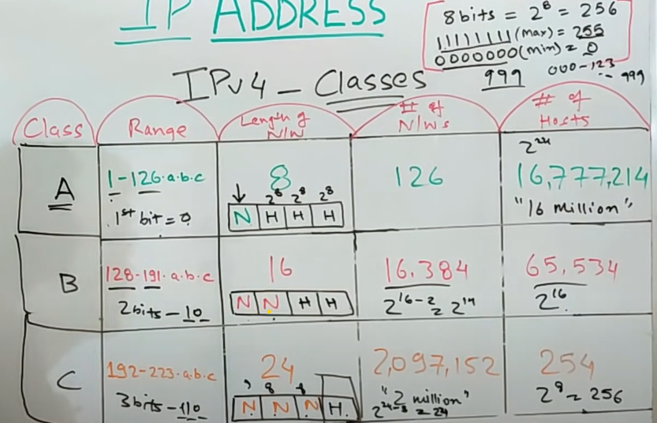
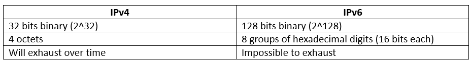

IP ADDRESSES:

    1) Binary basics
    2) IPv4 structure
    3) IP classes
    4) Public IP vs Private IP
    5) IPv4 vs IPv6

Binary Basics:
     
     Human understanding language - decimal - base 10 (power of 10)
     Machine understanding language - Binary - base 2 (power of 2) - represented by bits - 1 byte = 8 bits. 

    

IPv4: 

    It is an unique address respresented by 32-bit binary or 4 octets.
    xxx.xxx.xxx.xxx --> representation of IPv4 (dotted decimal number for human understanding)

    It is basically below the Transport (heart of OSI layer) called Network layer, where the unique IP address is identified and data forwarding happens.

    IP address has 2 parts
    1) Network ID's
    2) Host ID's

    This concept comes because IP addresses are limited (around 4 billion) so we need to use them effectively.
    The max IP address we could have is 255.255.255.255

IPv4 classes:

    The are 5 types of categories

    1) Class A
    2) Class B
    3) Class C
    4) class D - Multicast - not used much
    5) class E - Experimental - not used much.

    

    The above image displays the list of classes and the reserved bits for the specific classes, as mentioned in the image of an example for the class A a network has 1 network ID octet and 3 host ID octet we have more number of Host ID's and less number of Network ID's. 
    
    Class B we have two bit of four octet reserved for Network ID inside the class B. So we can say we have two network IDs and two host IDs for Class B two which are already reserved for this so, we will have (2^16-2) Network ID's and (2^16)-2 host Id's a class B network
    
    Class C network. We have three network IDs (2^24-3 = 2^21) and one host ID network (2^8-2 = 254) present for this class C. 

    

    For every host IP we have 2 bits going for (Network IP for that class and Broadcast IP) 
    No-of hosts/Network = (2^hostbits) - 2.

    Examples of class A network - the large one fall into this category. AT&T, IBM etc

    

    Note: The addresses of 127.0.0.0 is saved for loop and not part of any of the classes.

PUBLIC IP vs PRIVATE IP:

    let's understand what is the difference between a public IP and a private IP so we can say that a public IP is always there over the over the internet over the network. whenever you want to identify a device uniquely you need a public IP for that. But what if you want to use IP addresses for your local use. 
     
    Suppose within your company you have your local area network LAN and you want to distribute IPs for that you do not need the whole IP range which is reserved for public IP for that. That's why we have this dedicated IP range 10.0.0.0, 172.0.0.0, 192.0.0.0 so with You have IP addresses you see within the network would fall within this particular private IP range. 
     
    And then that is the case two different networks could have the same IP address is because these are only for private and the local use. 
     
    And that's why it can happen that two different networks you know might have the same IP addresses most of the time it is the case that you will have these IP addresses shared internally among different organizations that will be for local use. Obviously when you go to the public network, then you have to fall back upon your public IP ranges which we discussed above. 

IPv4 vs IPv6:

    

    We have been sustaining with IPv4 with different concepts comming over time into networking. Now a days many are adopting to IPv6.

    

    

