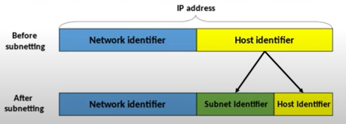
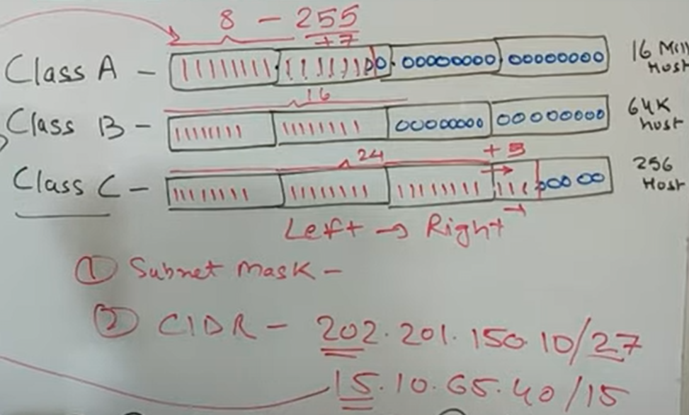
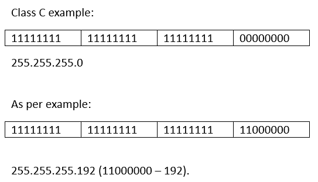
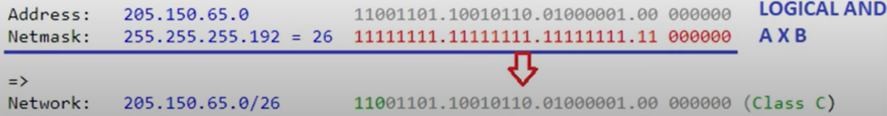
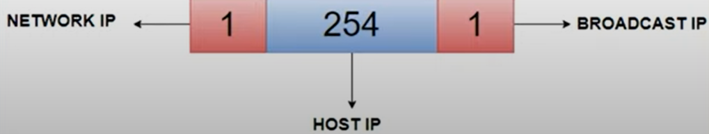

SUBNET:
    1) What is subnet?
    2) Subnetting concepts
    3) Examples of subnet

    Subet helps in mnaging your network efficently.
    Subnetting  helps you utilize your network bandwidth more intelligently. So as we just now saw that we have already pre defined network and host bits for your class A class B and Class C, But suppose you have a requirement wherein you do not require so many networks to go waste or so many goes to go waste. Okay, in that case, you divide one particular network into multiple sub networks based on your usage. And that is precisely what is subnetting. 

SUBNET MASK:

    Subnet mask is not an entity to be recognized on the network. It is a term which is used to denote or to specify in an IP address, that how many bits are given to the network and how many are given to the host.

    Subnet mask for class A: 255.0.0.0 (basically no-of network bits)
    Subnet mask for class B: 255.255.0.0
    Subnet mask for class C: 255.255.255.0

    Subnetting is always done from left to right. 

CIDR: Classless Inter Domain Routing. 

    CIDR means that regardless of any class simply by looking at your cider notation you can simply identify which bit of your IP addresses network and which bit is for host. It will be donated by / and then total no-of bits.

    Ex: 202.201.150.10/27 --> regardless of class 27 bits are given to Network.

   

Network ID:

    Every subnet IP will always have its first IP starting as your network IP or network ID. Okay. So suppose if you divide the network into five different sub networks, then every sub network will have a unique network ID with which it will connect to the network.

    Suppose a router wants to connect to a subnet, then it will remember its network ID or it will then derive its network ID based on the IP address of the device. 

Broadcast ID:

    So your broadcast ID is your last Id use last IP address of your subnet range and this particular broadcast ID is utilized to talk to all your host within that particular network. 

    NOTE: Network ID and BROADCAST ID are part of Host ID's. Total host ID's of an IP address would be (total Host ID's - Network ID and Broadcast ID).

SUBNETTING Example:

    Ex: 205.150.65.0/26 
    Usually range of 205 falls in class C which will have 24 Network ID’s and 8 host ID’s. But in our example the IP address is given with /26, which means, we need to consider this example as 26 Network ID’s.

    Class C example:
    11111111	11111111	11111111	00000000

    255.255.255.0

    As per example:
    11111111	11111111	11111111	11000000

    255.255.255.192 (11000000 – 192).

    26 will be under network ID range and 6 bits will go for Host’s.
    Now lets consider the subnetting of class C: It is 255.255.255.0. But now we have a case as host gives 2 bits to the network bits.

    Ex: 205.150.65.0/26 
    1) Subnet mask  - 255.255.255.192
    2) Network ID - (for this, there is a binary operation which we have to perform logical AND operation)
       
       AND OPERATION BETWEEN example and Subnet

       Basic AND Operation : Multiplication
       1 * 1 = 1
       1 * 0 = 0
       0 * 1 = 0
       0 * 0 = 0

     

        205.150.65.0          – 11001101.10010110.01000001.00000000      Perform AND for both
        255.255.255.192    - 11111111.11111111.11111111.11000000
        -----------------------------------------------------------------------------------
        205.150.65.0/26   -  11001101.10010110.01000001.00000000         (Class C)

    2) Network ID = 205.150.65.0/26

    3) No-of subnets - 2^n (n is no-of bits given to network) - 2^2 =4 subnets are possible
    4) No-of Hosts = [(2^n) - 2] n is no-of bits left in octate of Host - [(2^6)-2]=62.
    5) Broadcast ID 

 
        So from above example, to calucalte the network IP and broadcast IP we have to know the range of Host IP's.

        The range of Host IP are from 205.150.65.1, 205.150.65.1, 205.150.65.2........205.150.65.62.
        Before the Host Ip we will have network IP and Broadcast IP later to host IP.
        So we could say:
        a) Network IP: 205.150.65.0
        b) Broadcast IP: 205.150.65.63

    Ex2: 205.150.65.0/24, calucalte the below given taking the condition of creating 10 subnets.

    1) subnet mask: 255.255.255.240
    2) Network ID: 205.150.65.0/28
    3) No-of subnets = 10 (we can have 2^n = 16 subnets, but we only need 10)
    4) No of Hosts: 2^n - 4 = 16-2 = 14 
    5) Network IP: 205.150.65.0  next to this we have 14 hosts (205.150.65.1, 205.150.65.2 .... 205.150.65.14)
    6) Broadcast ID: 205.150.65.15

    We need to check where the 10 fits into the host bits, as to create subnet we only use host bits, as we go from ledt to right we should atleast have 4 bits to get 10 (1010). now we will convert all the used bits (1010) t0 create subnet into 1's to get the subnet mask of given IP address. (205.150.65.0 AND 255.255.255.240 = 205.150.65.0/28).

