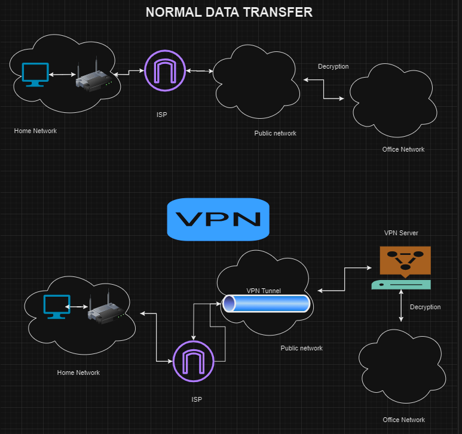

What is VPN ?
    Virtual private network - which helps in logging into public network ananymosly and privately, without any information or location to anyone.

Difference between accessing data normally vs VPN?

    Normal data access: It will be through home network --> Public network --> office network.
    For the same scenario, we will how data will be transported from home network to office network.

    as mentioned in the above text like the difference between normal data transfer and when we transfer data with the help of VPN, majorly when we transfer data normally it will be transperent throughout the traveled path. It means people sitting in the public network will know where the request is comming from and where the request is going. 

    Basically we'll take a scenario based example. Let's assume in Scenario having home application(India) we trying to access the Office application(USA). So what we'll do here is try to access something from our laptop from the home network. So our laptop connects with the router and connection happens between them and ask for ISP, which is internet service provider, and then go to public address with the same IP address of my computer from home network and then it moves from public network to office network to create the connection between home network and office network so that the connection is established. It is not secured.

    And now coming to VPN. VPN is basically changing of IP address I mean, it logs into public IP address anonymously or privately without giving any information or for network or location to maintain Annonymity and privacy. Basically in this the scenario are essentially the same example of the scenario taken, what will be the case is like when we are trying to access something from our laptop from the office network. Here, there will be a new channel created inside a public network called VPN tunnel. So  I mean, the requested packets go through that tunnel so that no data sitting in public addresses invades or knows the home network address and no one will be known it, through a tunnel we go inside it and access through VPN server. so by changing the IP address and the location of the place we are accessing, Basically, we could say that we are accessing this thing from the home network, but that but that won't be shown there. 
    Some some other network will be shown there and it fetches data from the office network to our home network without providing our home network address. 

ANNONYMITY: Hiding our identity. Location, IP address
PRIVACY: provides seurity of what data we are accessing/browsing.

    It is always better to use VPN for all the secured use. I would recommend everyone to use VPN for their personal things.